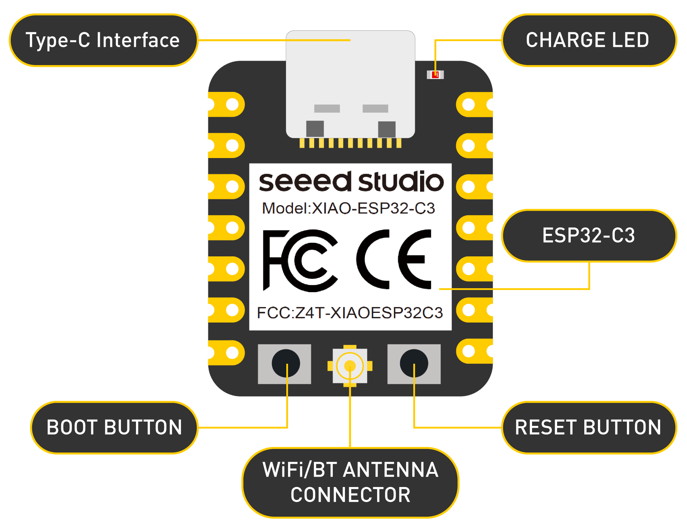

# ESP32_LED Documentation

## Project Description
The project involves using an ESP32, a mini development board, to control a little LED using Alexa. The motivation behind the project is to get introduced to the idea of Do-It-Yourself Internet of Things (DIY IoT), wherein we use off-the-shelf components and open source tools to build devices that connect to the internet, enabling a remote access and a transfer of data or commands.

The documentation hopes to serve anyone who is interested in building something fun. It assumes no expertise in any of the components described.

## Acknowledgement
The project was carried out with the help of the Makerspace Lab team at Ashoka University on 21st April 2025.

---
